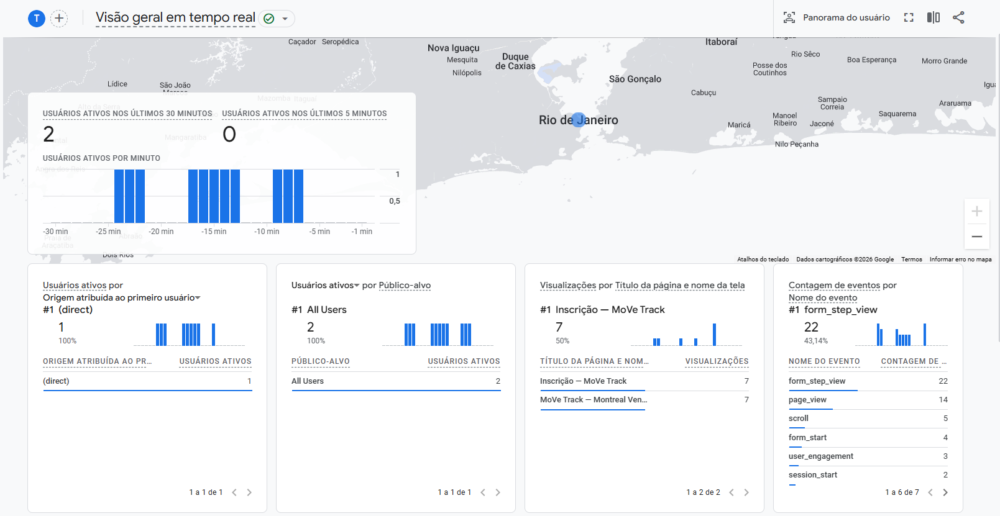
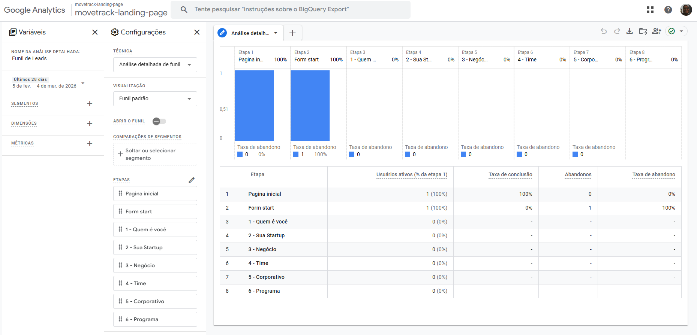
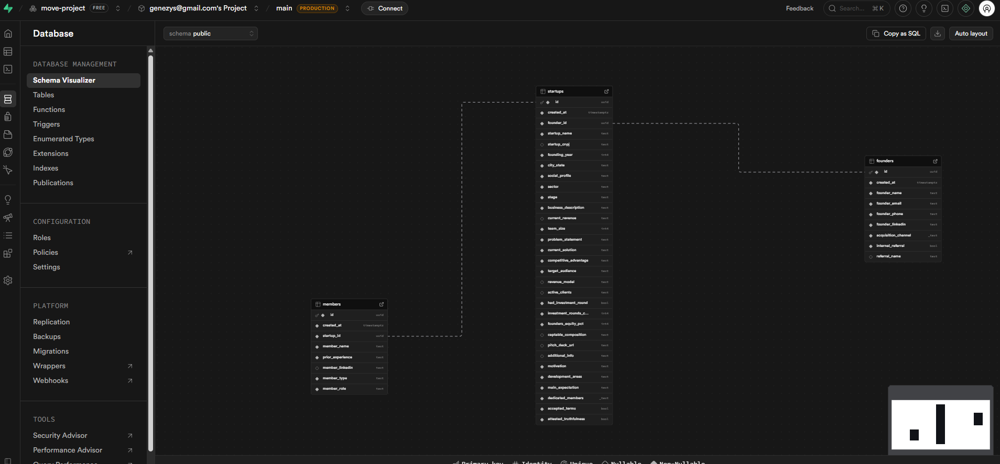
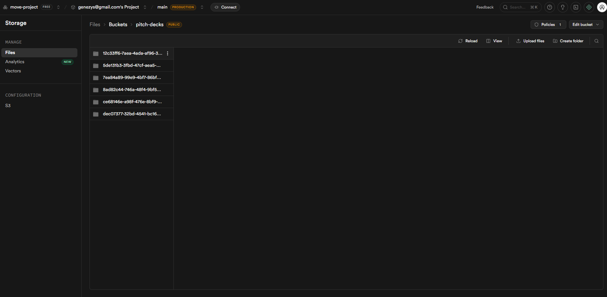
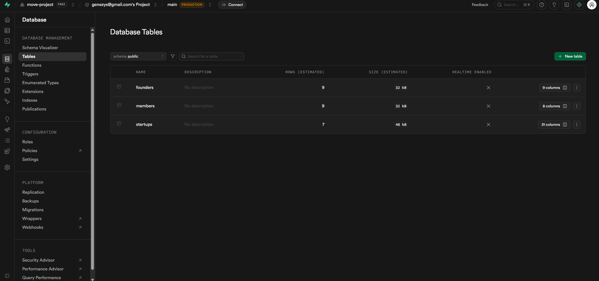
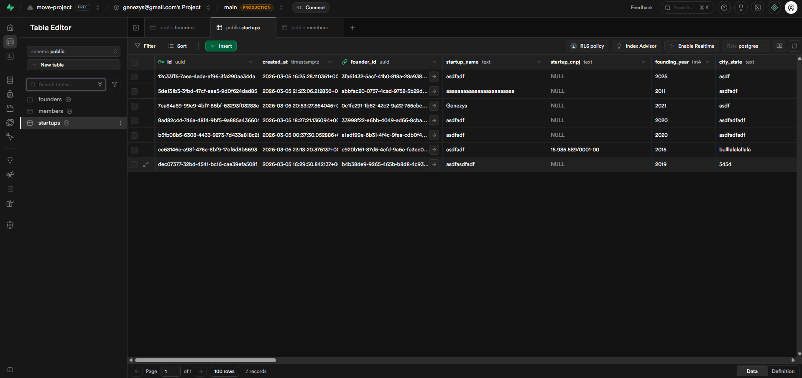

# MoVe Track — Startup Intake & Screening System

### **[→ ACESSAR O SISTEMA EM PRODUÇÃO](https://movedeploy.vercel.app)**
`movedeploy.vercel.app`

**Repositório:** [github.com/genezysg/move_deploy](https://github.com/genezysg/move_deploy)

---

## O Desafio

Estruturar a solução digital para o fluxo de captação e análise de startups do MoVe — o braço de aceleração da Montreal Ventures para startups early stage — cobrindo a jornada completa desde a atração até a triagem inteligente.

---

## O que foi construído

### Landing Page

Estrutura de conversão com proposta de valor, público-alvo, verticais do programa e modelo de equity. O conteúdo pode ser iterado pelos responsáveis do programa sem envolver desenvolvimento — basta especificar.

### Formulario Inteligente

Formulário com lógica condicional: as perguntas variam conforme as respostas anteriores e sinais de maturidade da startup. Permite adição dinâmica de membros do time fundador.

Integrado ao **Google Analytics** para que cada etapa do formulário apareça como um evento em um funil de conversão, dando visibilidade sobre onde os candidatos abandonam o processo.

| GA - Eventos | GA - Funil |
|---|---|
|  |  |

### CRM — Supabase como base estruturada

O Supabase (Postgres gerenciado) serve como CRM de análise. Cada submissão do formulário popula tabelas relacionais com dados estruturados da startup, time e respostas. A interface do Supabase permite que analistas filtrem, ordenem e atualizem o status de cada candidatura sem necessidade de um painel customizado — embora a arquitetura permita evoluir para um dashboard completo sem esforço de migração.

Além do banco de dados, o **Supabase Storage** é utilizado para armazenamento de arquivos — como pitch decks e documentos enviados pelas startups durante o processo de candidatura.

| Schema | Storage |
|---|---|
|  |  |

| Tabelas | Tabela de startups |
|---|---|
|  |  |

### IA Copiloto

> **Nota:** O módulo de IA Copiloto descrito abaixo é uma **proposta de implementação** — a arquitetura está definida e o código estruturado, mas a funcionalidade ainda não está em produção.

> **Vale destacar:** o **Claude** (da Anthropic) atuou como copiloto ativo no próprio desenvolvimento deste projeto — gerando código, revisando arquitetura, escrevendo specs e acelerando toda a construção. O que está descrito abaixo é a aplicação dessa mesma inteligência para o problema de triagem das startups.

Integração server-side com a API da Anthropic (Claude). A cada nova submissão, o copiloto geraria automaticamente:

- **Score** numérico de fit com o programa
- **Resumo executivo** em markdown
- **Risk flags** — lista de riscos e sinais de alerta identificados

Isso eliminaria o trabalho manual de triagem inicial e permitiria que os analistas focassem nas candidaturas com maior potencial.

---

## Stack e Justificativa

| Tecnologia | Papel | Justificativa |
|---|---|---|
| **Next.js 15** | Framework full-stack | App Router permite server components, API routes e server actions no mesmo projeto |
| **Supabase** | Banco de dados + backend | Postgres gerenciado com RLS, SDK tipado e interface visual — fácil de estender para CRM completo |
| **Vercel** | Deploy e hosting | Integração nativa com Next.js, previews automáticos por branch, zero config |
| **Claude API** | IA Copiloto | LLM de alta qualidade para geração de resumos e scoring estruturado |
| **Tailwind + shadcn/ui** | UI | Design system consistente com tokens customizáveis |

---

## Spec-Driven Development

O projeto foi estruturado com **especificações técnicas em arquivos Markdown** (`docs/spec.md`, `docs/features/`, `docs/database/`), que descrevem o comportamento esperado de cada módulo antes da implementação.

Isso resolve dois problemas:

1. **Velocidade de mudança:** alterações de layout, fluxo ou conteúdo podem ser especificadas sem reescrever código
2. **Acessibilidade para não-desenvolvedores:** uma pessoa que não sabe programar pode descrever adequadamente uma mudança nas specs e ter o sistema atualizado — desde que saiba especificar o que quer

---

## Essencial vs. Perfumaria

**Essencial — onde o tempo foi investido:**

- Tecnologia funcional e em produção
- Formulário inteligente com lógica condicional real
- Integração com GA para análise de funil
- Supabase como CRM extensível
- IA Copiloto operacional

**Perfumaria — decisões conscientes de não fazer:**

- **Conteúdo** (textos, copy, imagens da landing page) — não são os desenvolvedores que definem o conteúdo de um programa de aceleração, são os empreendedores. A estrutura está pronta para receber qualquer iteração sem custo de desenvolvimento.
- **Normalização avançada do banco** — unificar members/founders em uma tabela única e criar tabelas acessórias para campos multi-select seria correto em uma aplicação corporativa de longo prazo, mas adicionaria complexidade desnecessária para o porte e estágio deste projeto.
- **Testes automatizados e documentação da API** — as specs em Markdown (`docs/`) cumprem o papel de critérios de aceite e documentação neste estágio, com custo de manutenção muito menor.

---

## Critérios Atendidos

| Critério | Como foi endereçado |
|---|---|
| Visão de Produto | Jornada completa: atração → formulário → CRM → triagem com IA |
| Arquitetura e Stack | Next.js + Supabase + Vercel + Claude API com justificativas explícitas |
| Pensamento Sistêmico | Dados estruturados no Supabase prontos para análise e extensão |
| Uso de IA | Copiloto funcional gerando score, resumo e risk flags automaticamente |
| Clareza e Priorização | Tecnologia como essencial; conteúdo como perfumaria — sistema em produção |

---

## Tempo de Execução

Da concepção ao deploy em produção: **12 horas** de trabalho concentrado.
